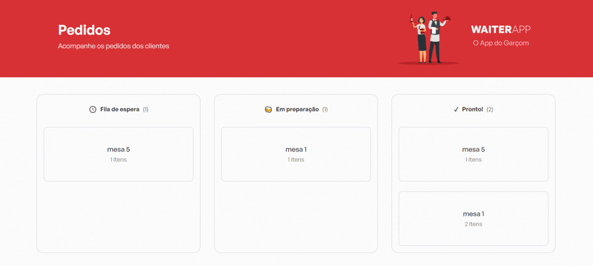
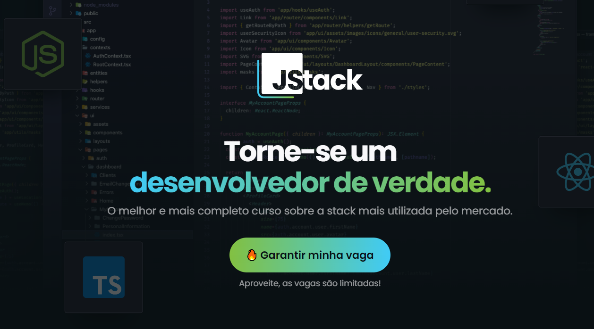

# Aplicativo Mobile e Web para Restaurantes

> Aplicativo para gestão de mesas em um restaurante, controle e fluxo de pedidos do cliente até a cozinha. 
>projeto desenvolvido pelo curso [JStack](https://jstack.com.br/).

## 🤝 Colaboradores

Contribuíram para este projeto:

<table>
  <tr>
    <td align="center">
      <a href="#">
         
        
          <b>Curso Jstack</b>
        
      </a>
    </td>
    <td align="center">
      <a href="https://www.linkedin.com/in/salvio-tonon-279579251/">
         
        
          <b>Front-End Salvio Tonon</b>
        
      </a>
    </td>
  </tr>
</table>

## 🚀 Stacks utilizadas no projeto

* [React](https://reactjs.org/) - framework de JavaScript web 
* [React-Native](https://reactnative.dev/) - framework de JavaScript mobile
* [HTML](https://developer.mozilla.org/pt-BR/docs/Web/HTML)  linguagem de marcação utilizada na construção de páginas na Web.
* [CSS](https://developer.mozilla.org/pt-BR/docs/Web/CSS) é um mecanismo para adicionar estilo (cores, fontes, espaçamento, etc.) a um documento web.
* [JavaScript](https://developer.mozilla.org/pt-BR/docs/Web/JavaScript) Linguagem de programação utilizada no projeto.
* [WebSockets](https://developer.mozilla.org/pt-BR/docs/Web/API/WebSockets_API) - torna possível abrir uma sessão de comunicação interativa entre o navegador do usuário e um servidor.
* [Styled-Component](https://styled-components.com/) - Poderosa junção de CSS e JavaScript utilizado para a estilização dos componentes
* [Express](https://expressjs.com/) - O framework de aplicativo da web NodeJS
* [MongoDB](https://www.mongodb.com/) -Software de banco de dados
* [NodeJs](https://nodejs.org/en) - Backend
* [Figma](https://www.figma.com/) - Software do design
* [Vite](https://vitejs.dev/) -ferramenta de construção que visa fornecer uma experiência de desenvolvimento mais rápida e enxuta para projetos web modernos

